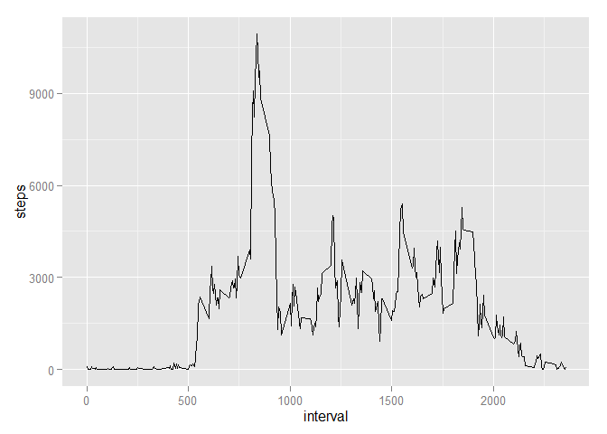

# Reproducible Research: Peer Assessment 1

### Introduction

This is a report created for the first assignement of the [Coursera Reproducible Research](https://class.coursera.org/repdata-015/) course.

### Data description

The data consists of two months of data from an anonymous individual collected during the months of October and November, 2012 and include the number of steps taken in 5 minute intervals each day.

The variables included in this dataset are:

* steps: Number of steps taking in a 5-minute interval (missing values are coded as NA)
* date: The date on which the measurement was taken in YYYY-MM-DD format
* interval: Identifier for the 5-minute interval in which measurement was taken

The dataset is stored in a comma-separated-value (CSV) file and there are a total of 17,568 observations in this dataset.

## Loading and preprocessing the data


```r
file <- "activity.csv"
data <- read.csv(file, stringsAsFactors = FALSE)
data <- transform(data, date = as.Date(date))
str(data)
```

```
## 'data.frame':	17568 obs. of  3 variables:
##  $ steps   : int  NA NA NA NA NA NA NA NA NA NA ...
##  $ date    : Date, format: "2012-10-01" "2012-10-01" ...
##  $ interval: int  0 5 10 15 20 25 30 35 40 45 ...
```


## What is mean total number of steps taken per day?


```r
steps_daily <- tapply(data$steps, data$date, sum, na.rm = TRUE)
library(ggplot2)
qplot(steps_daily)
```

 

```r
m1 <- mean(steps_daily, na.rm = TRUE)
m2 <- median(steps_daily, na.rm = TRUE)
```

The mean number of steps daily is 9354.2295082 and the median is 10395.

## What is the average daily activity pattern?


```r
steps <- tapply(data$steps, data$interval, sum, na.rm = TRUE)
x <- as.data.frame(steps)
x <- transform(x, interval = as.integer(rownames(x)))
ggplot(x, aes(interval, steps, group = 1)) + geom_line()
```

 

```r
m3 <- names(which.max(steps))
```

On average across all the days in the dataset the 835 interval contains maximum number of steps.

## Imputing missing values


```r
missing <- sum(!complete.cases(data))
```

The total number of missing values in the dataset (rows) is 2304.

#### Strategy for missing data

The following strategy is used for imputing missing data:

1. Find average number of steps for each day.
2. If there are no data at all for a given day then use the average number of steps for all days.
3. Fill in the missing data with the average number of steps for a given day.


```r
# Filling in missing data
# Getting average number of steps for each day
library(plyr)
x <- ddply(data, .(date), summarize, mean=mean(steps, na.rm = TRUE))
# Averge number of steps daily
m4 <- mean(x$mean, na.rm = TRUE)
# Filling in missing averages with the average for all days
for(i in 1:nrow(x)) {
    if(is.nan(x[i,2])) x[i,2] <- m4
}
# Imputing missing data
for(i in 1:nrow(data)) {
    if(is.na(data[i,"steps"])) {
        data[i,"steps"] <- x[x$date==data[i,"date"],"mean"]
    }
}
```

#### What is mean total number of steps taken per day? - after imputing data

```r
steps_daily <- tapply(data$steps, data$date, sum, na.rm = TRUE)
qplot(steps_daily)
```

 

```r
m11 <- mean(steps_daily, na.rm = TRUE)
m12 <- median(steps_daily, na.rm = TRUE)
cmp1 <- if(m1>m11) {"lower"} else {"higher"}
cmp2 <- if(m2<m12) {"lower"} else {"higher"}
```

The mean number of steps daily is 1.0766189\times 10^{4} and the median is 1.0766189\times 10^{4}.
The mean is higher and the median is lower than before imputing missing values.

## Are there differences in activity patterns between weekdays and weekends?


```r
Sys.setlocale("LC_TIME", "English")
weekdays <- weekdays(data$date, abbreviate = TRUE)
Sys.setlocale("LC_TIME", "")
weekpart <- as.vector(sapply(weekdays, function(x) {
    if(tolower(x) %in% c("sat", "sun")) "weekend" else "weekday"
}))
data$weekpart <- factor(weekpart)
steps2 <- ddply(data, .(weekpart, interval), summarize, mean_number_of_steps=mean(steps, na.rm = TRUE))
ggplot(steps2, aes(interval, mean_number_of_steps, group = 1)) +
    geom_line() + facet_grid(weekpart ~ .)
```

 

